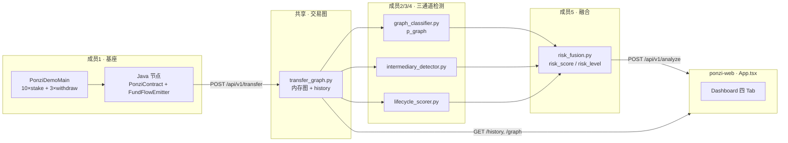

# PonziShield

Ethereum 庞氏合约检测演示系统：Java 资金流捕获 → Python 图分析 → React 可视化 Dashboard。

> **五人分工说明**：本项目按 5 个方案模块拆分，每人负责一个模块的 **后端逻辑 + 对应 UI + 联调**。下文逐一说明代码位置、数据流与界面设计。

---

## 目录

1. [整体架构](#1-整体架构)
2. [五人分工总表](#2-五人分工总表)
3. [成员 1：基座（Layer 1）](#3-成员-1基座layer-1)
4. [成员 2：ML 检测（图分类）](#4-成员-2ml-检测图分类)
5. [成员 3：优化 1 · 中介节点](#5-成员-3优化-1--中介节点)
6. [成员 4：优化 2 · 生命周期](#6-成员-4优化-2--生命周期)
7. [成员 5：风险融合](#7-成员-5风险融合)
8. [公共联调：analyze 聚合接口](#8-公共联调analyze-聚合接口)
9. [本地运行与部署](#9-本地运行与部署)

---

## 1. 整体架构



**数据主线**：Java 产生 transfer → Python 建图 → 三模块各算一个分数/特征 → 融合成 `risk_score` → 前端 Dashboard 展示。

---

## 2. 五人分工总表

| 成员 | 方案模块 | 主要 UI 板块 | 核心后端代码 | 你负责什么 |
|------|----------|-------------|-------------|-----------|
| **1** | 基座 | Demo 按钮、Tx Stream、Graph 边、Lifecycle 曲线、区块高度 | Java + `transfer_graph.py` + `/transfer` `/history` `/demo` | 链上 demo、资金流捕获、交易历史与图边数据 |
| **2** | ML 检测 | Risk Gauge 的 **p_graph** 通道、Report 里图分类概率 | `graph_classifier.py` + 模型 JSON | 2-hop 图特征、图模型推理、`p_graph` |
| **3** | 优化 1 | 中介表、Graph 红节点、Gauge 的 intermediary 通道 | `intermediary_detector.py` | 中介节点识别、betweenness、role |
| **4** | 优化 2 | 五维雷达、Lifecycle 四阶段条、Report 五维证据 | `lifecycle_scorer.py` | 四阶段 + 五维特征 scoring |
| **5** | 风险融合 | Risk Gauge 总分、三通道权重条、Toast 告警 | `risk_fusion.py` + `App.tsx` Gauge/Toast | 三通道加权、HIGH/MEDIUM/LOW、告警 |

**概念区分（写报告时用）**

| 概念 | 数量 | UI 位置 |
|------|------|---------|
| 生命周期**阶段** | 4 个 | Lifecycle Tab 四格进度条 |
| 生命周期**五维特征** | 5 个 | Overview 雷达图 |
| 检测**三通道** | 3 个 | p_graph + lifecycle + intermediary |

---

## 3. 成员 1：基座（Layer 1）

### 3.1 职责

- 嵌入式 Java 节点跑通 demo
- `PonziContract` 模拟 stake / withdraw / 推荐奖励
- `FundFlowEmitter` 在成功 transfer 后 POST 到 Python
- 提供 **Tx Stream、区块高度、Graph 边、Lifecycle 曲线** 的原始数据

### 3.2 代码位置

| 类型 | 路径 | 说明 |
|------|------|------|
| Java 基座（现有） | `PonziShield/eth-whitepaper-java-main/src/main/java/dev/naoki/ethwhite/` | 区块链核心、VM、sample 合约 |
| **待实现/恢复（PRD）** | `.../sample/PonziContract.java` | 庞氏 demo 合约 |
| **待实现/恢复（PRD）** | `.../ponzi/FundFlowEmitter.java` | 资金流 Observer |
| **待实现/恢复（PRD）** | `.../ponzi/AnalysisClient.java` | HTTP POST 到 Python |
| **待实现/恢复（PRD）** | `.../ponzi/PonziDemoMain.java` | 10×stake + 3×withdraw |
| **待实现/恢复（PRD）** | `.../core/WorldState.java` | transfer 成功后回调 emitter |
| Python 收 transfer | `PonziShield/ponzi-detector/api/main.py` | `POST /api/v1/transfer` |
| 交易图存储 | `PonziShield/ponzi-detector/api/tools/transfer_graph.py` | `TransferGraph` 类 |
| Demo 触发 API | `PonziShield/ponzi-detector/api/main.py` | `POST /api/v1/demo` 调 Maven |
| 启动脚本 | `/entrypoint.sh` | Sealos DevBox 8080 启动 |

详细设计见：`PonziShield/PonziShield_PRD.md` §5.4

### 3.3 后端逻辑

**`transfer_graph.py`**

```
TransferEvent(from, to, value, block_number, tx_hash, timestamp)
  → add_event() 写入 MultiDiGraph + _events 列表
  → events() 供 history / analyze 读取
  → graph_for(address, hop) 构建子图节点/边（供 Graph Tab）
```

**`main.py` 关键端点**

| 端点 | 作用 |
|------|------|
| `POST /api/v1/transfer` | Java emitter 写入一笔 transfer |
| `GET /api/v1/history` | 返回最近 200 笔 transfer（Tx Stream 数据源） |
| `GET /api/v1/graph/{address}?hop=1` | 以合约为中心的子图 JSON |
| `POST /api/v1/demo` | 执行 `PonziDemoMain`，返回 `contract_address` |

**Demo 数据流**

```
用户点 Demo → POST /api/v1/demo
  → Java: 部署 PonziContract → 10×stake → 3×withdraw
  → 每笔成功 transfer → FundFlowEmitter → POST /api/v1/transfer
  → 前端 invalidate history / analyze / graph
```

### 3.4 UI 设计（`ponzi-web/src/App.tsx`）

| UI 组件 | 函数名 | 行号区间（约） | 展示内容 | 数据来源 |
|---------|--------|---------------|----------|----------|
| **Topbar · 区块高度** | `Topbar` | L264–300 | `#currentBlock` | `history` 最大 block 或 lifecycle.age_blocks |
| **Topbar · Node/API 状态** | `StatusPill` | L303–308 | 绿/灰在线点 | `GET /api/v1/health` |
| **Demo 一键运行** | `Topbar` 按钮 | L295–297 | 触发 demo | `POST /api/v1/demo` |
| **Tx Stream** | `TxStream` | L561–577 | 滚动 from→to、value、block | `GET /api/v1/history`（1s 轮询） |
| **Graph Tab · 边** | `GraphTab` | L440–486 | SVG 交易图、时间轴滑块 | `GET /api/v1/graph/{address}` |
| **Lifecycle Tab · 曲线** | `LifecycleTab` | L489–523 | inflow/outflow 折线 | `history` 聚合（简化） |

**样式**：`ponzi-web/src/styles.css`

- `.tx-stream` / `.tx-item.hot`：命中当前合约的 transfer 高亮
- `.graph-node.contract`：合约节点金色
- `.stage-card.active`：当前生命周期阶段高亮

### 3.5 自测清单

- [ ] `mvn test` Java 测试通过
- [ ] 手动或 Demo 后 `GET /api/v1/history` 有 transfer
- [ ] 前端 Tx Stream 有滚动数据
- [ ] Graph Tab 有节点和边（Demo 后）

---

## 4. 成员 2：ML 检测（图分类）

### 4.1 职责

- 基于 **2-hop 交易邻域** 提取图特征
- 运行 `PonziShield GraphClassifier` 输出 **p_graph**（庞氏图模式概率）
- 提供模型元数据与 evidence 文案

### 4.2 代码位置

| 类型 | 路径 |
|------|------|
| 图分类器 | `PonziShield/ponzi-detector/api/tools/graph_classifier.py` |
| 模型权重 | `PonziShield/ponzi-detector/api/models/graph_classifier_v1.json` |
| 训练脚本 | `PonziShield/ponzi-detector/ml/train_graph_classifier.py` |
| 训练说明 | `PonziShield/ponzi-detector/ml/README.md` |
| 接入点 | `PonziShield/ponzi-detector/api/main.py` → `classify_graph()` |

### 4.3 后端逻辑

**流程**

```
events + contract_address
  → contract_neighborhood_events(hop=2)   # 2-hop 邻域子图
  → extract_graph_features()              # 12 个特征
  → logistic 模型: sigmoid(intercept + Σ w_i * x_i)
  → p_graph + model_name + evidence[]
```

**12 个图特征（`DEFAULT_FEATURES`）**

| 特征名 | 含义 |
|--------|------|
| `tx_count_norm` | 邻域交易规模 |
| `fan_in_norm` / `fan_out_norm` | 入/出度 |
| `same_block_payout_rate` | 同区块 payout 比例 |
| `recycling_ratio` | 短窗口资金回流 |
| `payout_ratio` | 流出/流入比 |
| `degree_centralization` | 合约中心化程度 |
| `neighborhood_density` | 2-hop 子图密度 |
| … | 见 `graph_classifier_v1.json` → `feature_schema` |

**`/analyze` 返回字段（你的模块）**

```json
"graph_analysis": {
  "p_graph": 0.9431,
  "model_name": "PonziShield GraphClassifier",
  "model_version": "v1.1.0",
  "feature_count": 12,
  "features": { "...": 0.85 },
  "evidence": ["多个外部地址向合约注资 (0.90)", "..."]
}
```

### 4.4 UI 设计

| UI 组件 | 函数名 | 展示内容 | 绑定字段 |
|---------|--------|----------|----------|
| **Risk Gauge · p_graph 权重条** | `WeightBar` label=`p_graph` | 图通道进度条 + 权重 w1 | `graph_analysis.p_graph`, `weights.w1` |
| **Report / 结论** | （analyze 响应） | 「图模型概率 xx%」 | `graph_analysis.p_graph` |

相关组件：`RiskGaugeCard`（L339–350）、`WeightBar`（L376–385）

**视觉**

- p_graph 通道标签固定为 `p_graph`
- 权重条宽度 = `value * 100%`，右侧数字 = `weights.w1`（默认 0.45）

### 4.5 自测清单

- [ ] `classify_graph()` 对 demo 合约返回 p_graph > 0.7
- [ ] 模型 JSON 可被加载
- [ ] Overview 里 p_graph 权重条有数值

---

## 5. 成员 3：优化 1 · 中介节点

### 5.1 职责

- 在合约相关交易子图中识别 **RELAY / ACCUMULATOR / DISTRIBUTOR**
- 计算 betweenness、holding blocks、evidence
- 为 Graph Tab 提供红色中介节点着色

### 5.2 代码位置

| 类型 | 路径 |
|------|------|
| 检测器 | `PonziShield/ponzi-detector/api/tools/intermediary_detector.py` |
| 接入 analyze | `api/main.py` → `detect_intermediaries()` |
| 接入 graph | `api/main.py` → `graph()` 传入 `intermediary_addresses` |
| 子图着色 | `transfer_graph.py` → `graph_for(..., intermediary_addresses)` |

### 5.3 后端逻辑

**识别规则（满足 ≥2 条则候选）**

1. betweenness > 0.05
2. 从合约收到 ≥2 笔且向合约发出 ≥1 笔
3. 平均 holding blocks ≤ 10
4. 从合约收到 ≥3 笔

**角色分配 `_role()`**

| 条件 | role |
|------|------|
| in≥2 且 out≥1 | `RELAY` |
| in > out | `ACCUMULATOR` |
| 其他 | `DISTRIBUTOR` |

**返回结构（最多 8 个）**

```json
{
  "address": "0xrelay...",
  "role": "RELAY",
  "betweenness": 0.32,
  "in_degree": 8,
  "out_degree": 5,
  "avg_holding_blocks": 3,
  "evidence": "8 contract payouts, 5 funding tx, avg hold 3 blocks"
}
```

**融合输入**：`intermediary_count` → 成员 5 的 `intermediary_factor = min(1, count/3)`

### 5.4 UI 设计

| UI 组件 | 函数名 | 展示内容 | 绑定字段 |
|---------|--------|----------|----------|
| **Overview · 中介表** | `IntermediaryTable` | address, role, betweenness, holding | `intermediaries[]` |
| **Graph Tab · 红节点** | `GraphTab` | `node.kind === "intermediary"` 红色 | graph API 节点 kind |
| **Risk Gauge · intermediary 条** | `WeightBar` | `min(1, count/3)` | `intermediaries.length`, `weights.w3` |
| **点击跳转 Graph** | `IntermediaryTable` onClick | `onFocusNode(address)` | — |

样式类：`.graph-node.intermediary`（红色），`.intermediary-table` 表格

### 5.5 自测清单

- [ ] Demo 后 `intermediaries` 非空
- [ ] Graph 上有红色节点
- [ ] 中介表可点击聚焦

---

## 6. 成员 4：优化 2 · 生命周期

### 6.1 职责

- 判定 **4 个阶段**：FUNDRAISING / PAYOUT / STAGNATION / COLLAPSE
- 计算 **5 维特征** scoring + evidence
- 输出 `lifecycle.score` 供融合

### 6.2 代码位置

| 类型 | 路径 |
|------|------|
| 评分器 | `PonziShield/ponzi-detector/api/tools/lifecycle_scorer.py` |
| 接入 | `api/main.py` → `score_lifecycle(..., is_demo_contract=...)` |

### 6.3 后端逻辑

**五维特征（`dimensions`）**

| 维度 key | 中文 | 检测逻辑概要 |
|----------|------|-------------|
| `fund_flow` | 资金流 | 有 inbound + outbound |
| `profit_logic` | 分红逻辑 | 同区块 payout ≥ 3 |
| `referral_mechanism` | 推荐机制 | stake(referrer) 触发的同区块 payout |
| `withdrawal_control` | 提款控制 | 募资后出现 withdraw |
| `camouflage` | 伪装 | demo 合约或 inbound≥5 |

**四阶段 `_stage()`**

| 阶段 | 条件 |
|------|------|
| FUNDRAISING | 默认 / 仅有募资 |
| PAYOUT | 有 inbound 且有 outbound |
| STAGNATION | 有 post-fundraising withdraw |
| COLLAPSE | 上述 + current_block ≥ 1000 |

**阶段得分 `_stage_score()`**：不同阶段对五维赋不同权重求加权和 → `lifecycle.score`

**返回示例**

```json
"lifecycle": {
  "stage": "STAGNATION",
  "age_blocks": 250,
  "score": 0.78,
  "dimensions": {
    "fund_flow": { "detected": true, "score": 0.9, "evidence": "..." },
    "...": "..."
  }
}
```

### 6.4 UI 设计

| UI 组件 | 函数名 | 展示内容 | 绑定字段 |
|---------|--------|----------|----------|
| **Overview · 五维雷达** | `RadarCard` | Recharts 雷达图 | `lifecycle.dimensions.*.score` |
| **Lifecycle Tab · 四阶段** | `LifecycleTab` stage-track | 4 格进度，当前 stage 高亮 | `lifecycle.stage` |
| **Lifecycle Tab · 曲线** | `LifecycleTab` LineChart | 绿 inflow / 红 outflow | `history` 简化聚合 |
| **Risk Gauge · lifecycle 条** | `WeightBar` label=`lifecycle` | 生命周期通道 | `lifecycle.score`, `weights.w2` |

样式：`.stage-card.active` 蓝色边框；雷达图 stroke `#38bdf8`

### 6.5 自测清单

- [ ] Demo 后 stage 为 PAYOUT 或 STAGNATION
- [ ] 雷达图五维有数值
- [ ] 至少 3 个 dimension `detected: true`

---

## 7. 成员 5：风险融合

### 7.1 职责

- 三通道加权融合为 **0–100 risk_score**
- 输出 **HIGH / MEDIUM / LOW**
- 前端 Gauge、Toast 告警、权重展示

### 7.2 代码位置

| 类型 | 路径 |
|------|------|
| 融合算法 | `PonziShield/ponzi-detector/api/tools/risk_fusion.py` |
| 接入 | `api/main.py` → `fuse_risk(p_graph, lifecycle.score, len(intermediaries))` |
| 前端 Gauge | `App.tsx` → `RiskGaugeCard`, `RiskGauge`, `WeightBar` |
| Toast 告警 | `App.tsx` → `useEffect` 监听 `risk_score >= 70` |

### 7.3 后端逻辑

**公式（`risk_fusion.py`）**

```
intermediary_factor = min(1.0, intermediary_count / 3)

risk_raw = w1 * p_graph + w2 * lifecycle_score + w3 * intermediary_factor

risk_score = risk_raw * 100   # 保留 1 位小数

risk_level:
  >= 70 → HIGH
  >= 40 → MEDIUM
  else  → LOW
```

**默认权重**

| 通道 | 权重 | 来源 |
|------|------|------|
| w1 图模型 | 0.45 | 成员 2 |
| w2 生命周期 | 0.35 | 成员 4 |
| w3 中介 | 0.20 | 成员 3 |

**返回**

```json
{
  "risk_score": 96.4,
  "risk_level": "HIGH",
  "weights": { "w1": 0.45, "w2": 0.35, "w3": 0.20 }
}
```

### 7.4 UI 设计

| UI 组件 | 函数名 | 展示内容 |
|---------|--------|----------|
| **Risk Gauge 总分** | `RiskGauge` | 半圆仪表 0–100 + LOW/MEDIUM/HIGH 颜色 |
| **三通道权重条** | `RiskGaugeCard` 内 3×`WeightBar` | p_graph / lifecycle / intermediary |
| **Toast 告警** | `Toast` | risk≥70 时弹出 HIGH 提示 |
| **Report 对比卡** | `CompareCard` | Ponzi vs Token 风险并排（mock） |

**Gauge 颜色（styles.css）**

- `.gauge.high` → 红色系
- `.gauge.medium` → 琥珀色
- `.gauge.low` → 绿色系

### 7.5 自测清单

- [ ] Demo 后 risk_score ≥ 70 且 Toast 弹出
- [ ] 三权重条与 `weights` 一致
- [ ] 改 w1/w2/w3 后分数变化符合预期

---

## 8. 公共联调：analyze 聚合接口

所有成员的最终输出在 **`POST /api/v1/analyze`** 汇聚：

```json
{
  "contract_address": "0x...",
  "risk_score": 96.4,
  "risk_level": "HIGH",
  "lifecycle": { "...成员4..." },
  "graph_analysis": { "...成员2..." },
  "intermediaries": [ "...成员3..." ],
  "weights": { "...成员5..." }
}
```

**前端拉取逻辑（`App.tsx`）**

```typescript
// 每 5s health；每 1s history；切换地址时 analyze + graph
const report = useQuery(["analyze", selectedAddress], () =>
  postJson("/api/v1/analyze", { contract_address, current_block })
);
```

**联调顺序建议**

1. 成员 1 先保证 `/transfer` + `/history` 有数据
2. 成员 2/3/4 各自模块单测 + 接入 analyze
3. 成员 5 验证融合分数
4. 全员在前端 Overview / 各 Tab 验收

---

## 9. 本地运行与部署

### 后端

```bash
cd PonziShield/ponzi-detector
python3 -m venv .venv && source .venv/bin/activate
pip install -r requirements.txt
uvicorn api.main:app --host 0.0.0.0 --port 8000
```

### 前端

```bash
cd PonziShield/ponzi-web
npm install
npm run dev    # http://localhost:5173
```

### Sealos DevBox

```bash
cd PonziShield/ponzi-web && npm run build
/home/devbox/project/entrypoint.sh prod   # 端口 8080
```

详见 `PonziShield/DEPLOY.md`

---

## 附录：前端文件地图

| 文件 | 作用 |
|------|------|
| `ponzi-web/src/App.tsx` | **全部 UI 组件**（Topbar/Tabs/Overview/Graph/Lifecycle/Report） |
| `ponzi-web/src/styles.css` | 深色主题、Gauge、Graph 节点颜色 |
| `ponzi-web/src/main.tsx` | React 入口 |
| `ponzi-web/vite.config.ts` | 构建配置 |

## 附录：后端文件地图

| 文件 | 成员 |
|------|------|
| `api/main.py` | 全员（路由聚合） |
| `api/tools/transfer_graph.py` | 成员 1 |
| `api/tools/graph_classifier.py` | 成员 2 |
| `api/tools/intermediary_detector.py` | 成员 3 |
| `api/tools/lifecycle_scorer.py` | 成员 4 |
| `api/tools/risk_fusion.py` | 成员 5 |

## 附录：PRD 与 Excel 对照表

- 产品需求：`PonziShield/PonziShield_PRD.md`
- UI↔方案对照 Excel：见仓库外桌面导出 `PonziShield_UI方案对照总表.xlsx`（可后续加入 `docs/`）

---

**License**：课程 / 研究演示项目。
