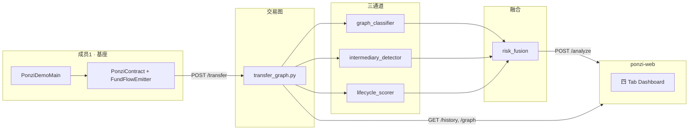

# PonziShield

Ethereum 庞氏合约检测演示系统：**Java 资金流捕获 → Python 三通道分析 → React Dashboard**。

仓库：https://github.com/1589572071-bot/Ponzi

---

## 快速开始

### 一体部署（推荐 · Sealos / 本地）

```bash
cd PonziShield/ponzi-web && npm install && npm run build
/home/devbox/project/entrypoint.sh prod   # http://localhost:8080
```

浏览器打开 **8080** 端口（Sealos 用控制台外网地址 + 8080）。

### 开发模式（前后端分离）

```bash
# 终端 1 · API
cd PonziShield/ponzi-detector
python3 -m venv .venv && source .venv/bin/activate
pip install -r requirements.txt
uvicorn api.main:app --host 127.0.0.1 --port 8000

# 终端 2 · 前端
cd PonziShield/ponzi-web && npm install && npm run dev   # http://localhost:5173
```

点击 Topbar **Demo 一键运行** → 自动跑 Java `PonziDemoMain`（10×stake + 3×withdraw）→ Tx Stream / Graph / 风险报告刷新。

---

## 当前实现状态

| 模块 | 状态 | 说明 |
|------|------|------|
| Java 基座 + PonziContract | ✅ | `PonziDemoMain`、FundFlowEmitter、`WorldState` 回调 |
| FastAPI 聚合 | ✅ | `/transfer` `/history` `/graph` `/analyze` `/demo` |
| 三通道检测 | ✅ | 图分类 / 中介节点 / 生命周期 |
| 风险融合 | ✅ | `risk_score` 0–100，HIGH/MEDIUM/LOW |
| Dashboard | ✅ | Overview / Graph / Lifecycle / **Report 可视化报告** |
| ethXpose 训练流水线 | ✅ | `ponzi-detector/ml/`（可选替换模型 JSON） |

详细产品规格：`PonziShield/PonziShield_PRD.md`  
部署说明：`PonziShield/DEPLOY.md`

---

## 整体架构



**Demo 数据流**

```
Demo 按钮 → POST /api/v1/demo
  → Java 部署 PonziContract → 10×stake → 3×withdraw
  → 每笔 transfer → FundFlowEmitter → POST /api/v1/transfer
  → 前端轮询 history / analyze / graph
```

---

## 五人分工总表

| 成员 | 方案模块 | 主要 UI | 核心后端 |
|------|----------|---------|----------|
| **1** | 基座 | Demo、Tx Stream、Graph 边、区块高度 | Java + `transfer_graph.py` |
| **2** | ML 检测 | Gauge · p_graph 通道 | `graph_classifier.py` |
| **3** | 优化 1 | 中介表、Graph 红节点 | `intermediary_detector.py` |
| **4** | 优化 2 | 五维雷达、Lifecycle 四阶段 | `lifecycle_scorer.py` |
| **5** | 风险融合 | 总分 Gauge、权重条、Toast | `risk_fusion.py` |

**概念区分**

| 概念 | 数量 | UI 位置 |
|------|------|---------|
| 生命周期阶段 | 4 | Lifecycle Tab |
| 五维特征 | 5 | Overview 雷达图 |
| 检测三通道 | 3 | p_graph + lifecycle + intermediary |

---

## 成员 1：基座（Layer 1）

### 职责

- `PonziContract`：`stake(referrer)` / `withdraw()` / 推荐奖励 / 分红逻辑
- `FundFlowEmitter`：成功 transfer 后 POST Python
- `PonziDemoMain`：一键 demo 场景

### 代码位置

| 文件 | 路径 |
|------|------|
| 庞氏合约 | `eth-whitepaper-java-main/.../sample/PonziContract.java` |
| 资金流 Observer | `.../ponzi/FundFlowEmitter.java` |
| HTTP 客户端 | `.../ponzi/AnalysisClient.java` |
| Demo 入口 | `.../ponzi/PonziDemoMain.java` |
| 转账回调 | `.../core/WorldState.java` |
| 合约注册 | `.../sample/ContractCatalog.java` |
| Python 收 transfer | `ponzi-detector/api/main.py` |
| 交易图 | `ponzi-detector/api/tools/transfer_graph.py` |

### 自测

```bash
cd PonziShield/eth-whitepaper-java-main
source .tools/env.sh && mvn test
mvn -q exec:java -Dexec.mainClass=dev.naoki.ethwhite.ponzi.PonziDemoMain
```

---

## 成员 2：ML 检测（图分类）

| 文件 | 说明 |
|------|------|
| `api/tools/graph_classifier.py` | 2-hop 特征 + p_graph |
| `api/models/graph_classifier_v1.json` | 模型权重 |
| `ml/train_graph_classifier.py` | 训练脚本 |

Overview **WeightBar · p_graph** 绑定 `graph_analysis.p_graph` 与 `weights.w1`。

---

## 成员 3：优化 1 · 中介节点

| 文件 | 说明 |
|------|------|
| `api/tools/intermediary_detector.py` | RELAY / ACCUMULATOR / DISTRIBUTOR |

Overview **中介表** + Graph **红色节点**；融合通道 `intermediary_factor = min(1, count/3)`。

---

## 成员 4：优化 2 · 生命周期

| 文件 | 说明 |
|------|------|
| `api/tools/lifecycle_scorer.py` | 四阶段 + 五维 scoring |

阶段：`FUNDRAISING` → `PAYOUT` → `STAGNATION` → `COLLAPSE`  
维度：fund_flow / profit_logic / referral / withdrawal_control / camouflage

---

## 成员 5：风险融合

**公式**（`risk_fusion.py`）

```
risk_raw = 0.45×p_graph + 0.35×lifecycle_score + 0.20×min(1, count/3)
risk_score = risk_raw × 100
```

| 分数 | 等级 |
|------|------|
| ≥ 70 | HIGH |
| ≥ 40 | MEDIUM |
| 其他 | LOW |

`risk_score ≥ 70` 时前端 Toast 告警。

---

## 前端 Dashboard（`ponzi-web/src/App.tsx`）

| Tab | 内容 |
|-----|------|
| **Overview** | Risk Gauge、五维雷达、中介表 |
| **Graph** | SVG 交易图、区块时间轴 |
| **Lifecycle** | 四阶段进度、inflow/outflow 曲线 |
| **Report** | **可视化分析报告**（结论、三通道、五维证据、中介摘要；可导出 JSON） |

样式：`ponzi-web/src/styles.css`（深色主题，紧凑字号）

---

## API 速查

| 方法 | 路径 | 说明 |
|------|------|------|
| GET | `/api/v1/health` | 健康检查 |
| POST | `/api/v1/transfer` | Java 写入 transfer |
| GET | `/api/v1/history` | Tx Stream 数据源 |
| GET | `/api/v1/graph/{address}?hop=1` | 子图 JSON |
| POST | `/api/v1/analyze` | 聚合风险报告 |
| POST | `/api/v1/demo` | 运行 Java demo |

---

## 目录结构

```
PonziShield/
├── eth-whitepaper-java-main/    # Layer 1 Java 基座
├── ponzi-detector/              # FastAPI + 检测模块 + ml/
├── ponzi-web/                   # React Dashboard
├── PonziShield_PRD.md
└── DEPLOY.md
entrypoint.sh                    # Sealos DevBox 8080 启动
```

---

## 联调顺序

1. 成员 1：`/demo` + `/history` 有真实 transfer
2. 成员 2/3/4：各自模块接入 `/analyze`
3. 成员 5：验证融合分数与 Toast
4. 全员：Overview / Report Tab 验收

---

**License**：课程 / 研究演示项目。
